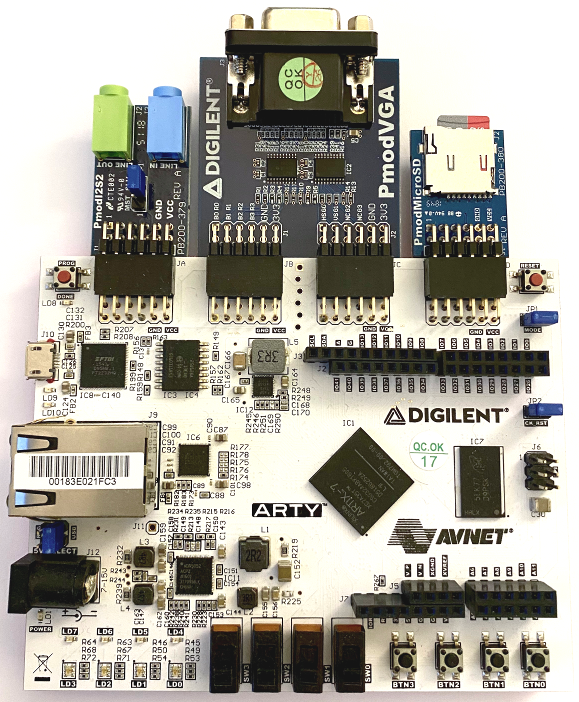
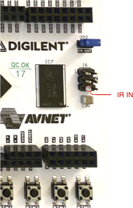
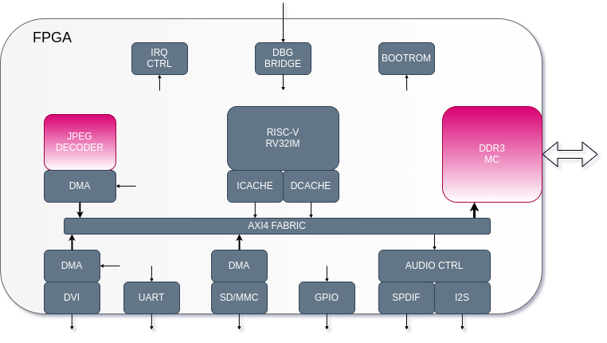

# FPGA Media Player

This project is a FPGA based media player which is capable of playing [Motion JPEG](https://en.wikipedia.org/wiki/Motion_JPEG) encoded video over HDMI or VGA on commonly available FPGA boards.


## Features
* 800x600 25fps video (higher resolutions may also be possible)
* 44.1KHz stereo audio (I2S or SPDIF)
* Hardware accelerated JPEG decoding
* SD/MMC card interface (FAT16/32 support)
* MP3 playback (SW codec)
* JPEG stills display
* IR remote control

## Supported Hardware
* [Digilent Arty A7](https://reference.digilentinc.com/reference/programmable-logic/arty-a7/start) + [PMOD I2S2](https://reference.digilentinc.com/reference/pmod/pmodi2s2/start) + [PMOD MicroSD](https://reference.digilentinc.com/reference/pmod/pmodmicrosd/start) + [PMOD VGA](https://reference.digilentinc.com/reference/pmod/pmodvga/start) or PMOD2HDMI Breakout Cable + IR receiver





## Cloning

This repo contains submodules.  
Make sure to clone them all with the following command;

```
git clone --recursive https://github.com/ultraembedded/FPGAmp.git

```

## Block Diagram


## Project Files

The FPGA gateware for this project is constructed from various sub-projects;
* [CPU - RISC-V](https://github.com/ultraembedded/riscv)
* [Peripherals](https://github.com/ultraembedded/core_soc)
* [UART -> AXI Debug Bridge](https://github.com/ultraembedded/core_dbg_bridge)
* [SD/MMC interface](https://github.com/ultraembedded/core_mmc)
* [JPEG decoder](https://github.com/ultraembedded/core_jpeg_decoder)
* [Audio controller](https://github.com/ultraembedded/core_audio)
* [DVI framebuffer](https://github.com/ultraembedded/core_dvi_framebuffer)

On the firmware side, this project uses;
* [Custom RTOS](https://github.com/ultraembedded/librtos)
* [FAT32 Library](https://github.com/ultraembedded/fat_io_lib)
* [MP3 decoder](https://github.com/ultraembedded/libhelix-mp3)
* [LVGL User Interface](https://github.com/lvgl/lvgl)

## Getting Started

The firmware needs to be built with the 32-bit RISC-V (RVIM) GCC;
```
# 1. Build firmware
cd firmware/app
make

# 2. Copy firmware/app/build.riscv.boot/boot.bin to a FAT32 SD card
```

The bootROM in the FPGA fabric will automatically load 'boot.bin' from the SD card root directory.  
**NOTE**: The SD card must be formatted as FAT16 or FAT32 and not EXFAT!

Debug messages will be comming out of the ArtyA7 USB-UART @ 1M baud (8N1).

